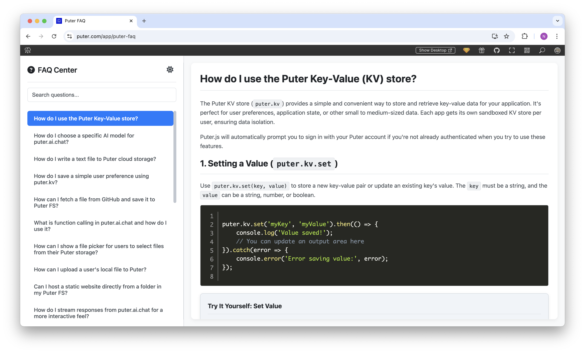

<h1 align="center">
  <a href="https://puter.com/app/faq" target="_blank">Puter FAQ Center</a>
</h1>

<p align="center">A modern, searchable FAQ system for Puter with dark/light theme support and responsive design.</p>

<p align="center">
  
</p>

<br>

## Features

- **Comprehensive FAQ Collection**: Organized answers to common Puter platform questions
- **Searchable Interface**: Quickly find answers with the built-in search functionality
- **Dark/Light Theme**: Toggle between themes based on your preference
- **Responsive Design**: Works seamlessly on desktop and mobile devices
- **Syntax Highlighting**: Code examples with proper highlighting for better readability
- **Interactive Examples**: Try-it-yourself code samples for hands-on learning
- **Resizable Layout**: Adjustable sidebar width for optimal reading experience

<br>

## Getting Started

Clone the repository:

```bash
git clone https://github.com/puter-apps/faq.git
```

and open the `/src/index.html` file in your browser.

<br>

## How It Works

The FAQ Center uses a simple but effective architecture:

1. **HTML Structure**: The main `index.html` file contains the application shell with sidebar and content area
2. **Dynamic Content Loading**: FAQ answers are stored as separate HTML files in the `/src/answers/` directory
3. **Client-side Search**: JavaScript-powered search functionality filters questions in real-time
4. **Theme Management**: Automatically detects system preference and allows manual theme toggling
5. **Responsive Design**: CSS variables and media queries ensure proper display on all devices

<br>

## Adding New FAQ Items

To add a new FAQ:

1. Create a new HTML file in the `/src/answers/` directory with the next sequential number
2. Include the question as an HTML comment at the top of the file: `<!-- q: Your Question Here? -->`
3. Structure your answer using the provided CSS classes for consistent styling
4. For code examples, use the Prism.js syntax highlighting with the provided CSS classes

<br>

## Technical Details

This application uses:
- Vanilla JavaScript for dynamic content loading and interactivity
- CSS variables for theming and consistent styling
- Font Awesome icons for UI elements
- Prism.js for code syntax highlighting
- Responsive design principles for all device sizes

<br>

## License

MIT
